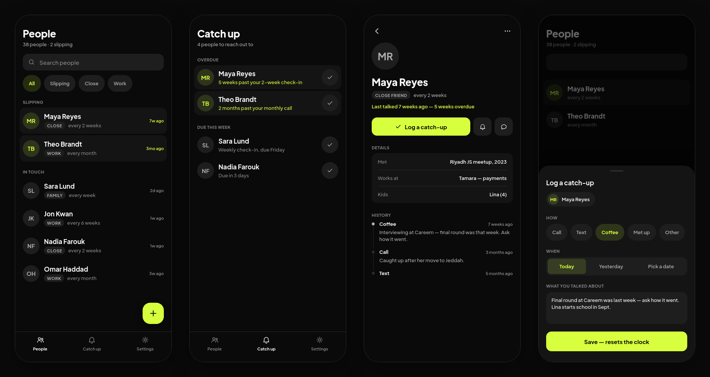

<p align="center">
  
</p>

<h1 align="center">Tether</h1>

<p align="center">
  <b>A personal CRM for Android.</b><br />
  The people you care about, how often you mean to reach out, and whether you're slipping.
</p>

Tether is offline-first by design: no account, no server, no sync. Everything about a person
and every catch-up stays on your phone.



<sub>Screens from the app's design. The app itself has moved on a little since, and now also has a Circle tab.</sub>

## Features

- **People** — everyone you keep up with, led by whoever is slipping, filtered by relationship.
- **Catch up** — who's due, with a one-tap log (and undo).
- **Cadences** — "every 2 weeks", "every month", or Never. Someone is due when the time since
  you last spoke passes their cadence. Overdue is a distance, not a debt that piles up.
- **Log a catch-up** — when, what kind, where (paste a Google Maps link and it names the place),
  who reached out, and notes. History can be edited or deleted, with undo.
- **Person detail** — relationship, workplace and role, free-form details ("Met", "Kids"),
  connections to other people, and a history of every catch-up.
- **Connections** — who knows who, added in batches with one shared label ("From university").
- **Circle** — you in the middle, everyone around you: closer the more recently you spoke,
  coloured by relationship, with connections drawn between them.
- **Import from contacts** — a one-time picker, followed by a short walk that asks what each
  person is to you. Tether never writes to your address book.
- **Reminders** — one moment about one person ("coffee with Maya, Saturday at seven").
- **Weekly nudge** — a single notification naming who's due, on the day and hour you choose.
- **Search** — names, work, details, notes and places.
- **App lock** — biometric or device credential, on launch and after 60 seconds away.
- **Backups** — export to a readable JSON file; importing merges rather than overwrites, so
  restoring the same file twice changes nothing.

## Privacy

Tether makes exactly one kind of network request: resolving a pasted short Google Maps link to
learn the place's name. Nothing about a person or a catch-up ever leaves the device. Your
database *is* the archive, so export a backup now and then.

| Permission          | Why                                              |
|---------------------|--------------------------------------------------|
| `READ_CONTACTS`     | Only when you tap "Pick from contacts"           |
| `POST_NOTIFICATIONS`| The weekly nudge and reminders                   |
| `USE_BIOMETRIC`     | The optional app lock                            |
| `INTERNET`          | Naming pasted Google Maps short links            |

The lock stops someone picking up an unlocked phone. It is not encryption at rest.

## Building

Requires Android Studio with AGP 9 support, JDK 17+, and a device or emulator on Android 12
(API 31) or later.

```bash
git clone https://github.com/BassamAlim/Tether.git
cd Tether
./gradlew :app:assembleDebug        # build
./gradlew :app:installDebug         # install on a connected device
./gradlew :app:testDebugUnitTest    # unit tests
```

## Stack

Kotlin · Jetpack Compose · Material 3 · Hilt (KSP) · Room · DataStore · Navigation Compose
(type-safe routes) · WorkManager · AndroidX Biometric

MVVM over a single data layer, with dependencies pointing one way:
UI → ViewModel → Domain → Repository → DAO/DataStore.

```
app/src/main/java/bassamalim/tether/
  core/        data (Room, repositories), domain rules, navigation, theme, shared UI,
               backup, lock, nudge, reminder
  features/    one package per screen: Screen, ViewModel, UiState, Domain
```

See [`CLAUDE.md`](CLAUDE.md) for the architecture rules, design system and product decisions
in full.
